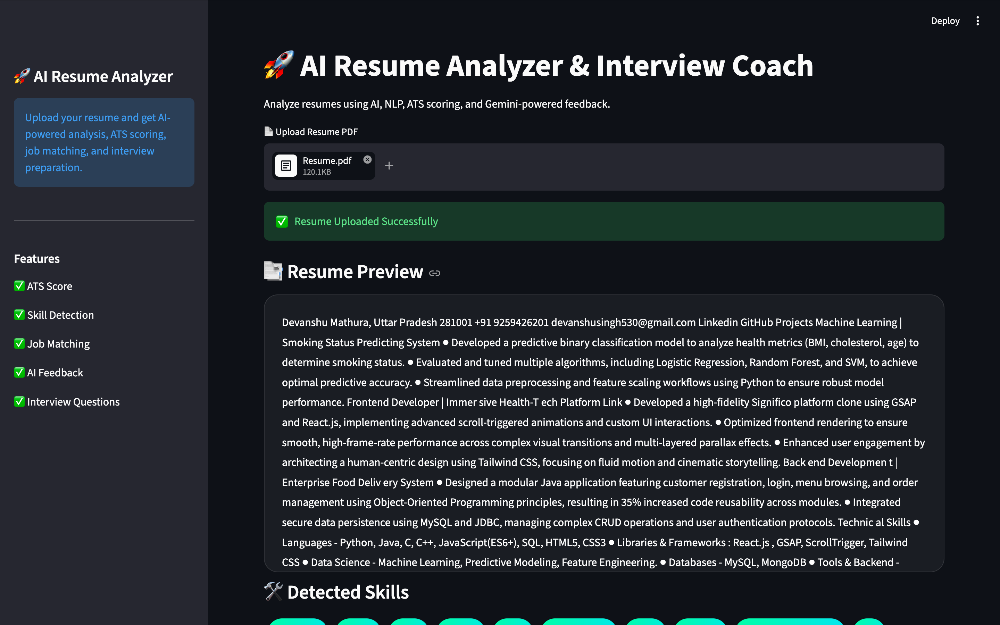
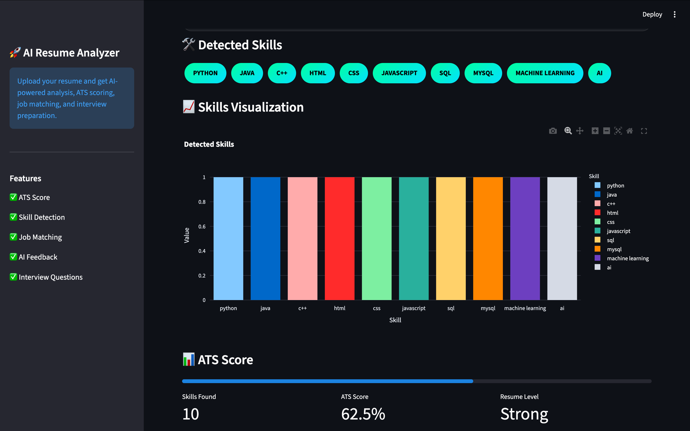
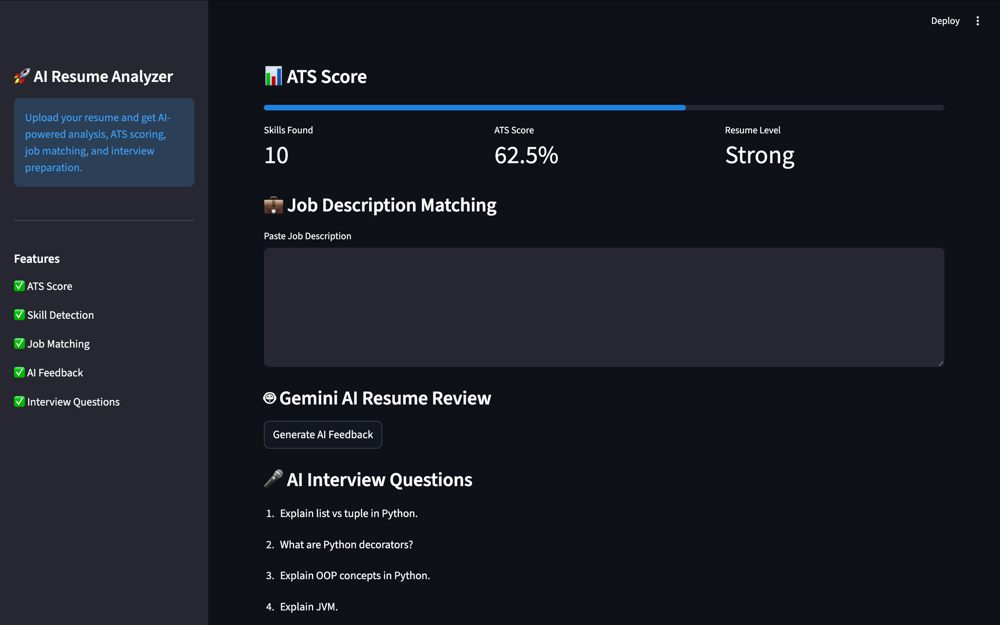
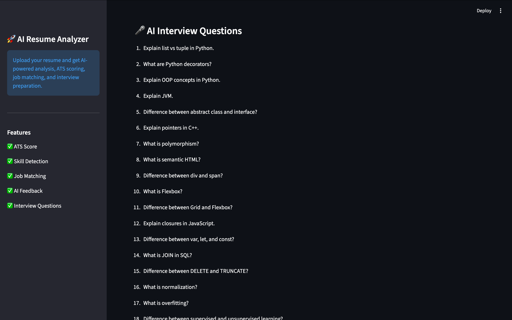

# 🚀 AI Resume Analyzer & Interview Coach

An AI-powered Resume Analyzer built using Python and Streamlit that helps users analyze resumes, calculate ATS scores, detect skills, match job descriptions, and generate interview questions.

---

# 📌 Features

✅ Resume PDF Upload  
✅ Resume Text Extraction  
✅ ATS Score Calculation  
✅ Skill Detection  
✅ Skills Visualization Chart  
✅ Job Description Matching  
✅ Resume Analysis  
✅ Improvement Suggestions  
✅ AI Interview Questions  
✅ Modern Dashboard UI  
✅ Interactive Charts  
✅ Dark Theme Interface  

---

# 🛠 Technologies Used

| Technology | Purpose |
|---|---|
| Python | Backend Logic |
| Streamlit | Web Application UI |
| PyPDF2 | PDF Text Extraction |
| Pandas | Data Handling |
| Plotly | Charts & Visualization |
| Scikit-learn | Similarity Matching |
| NLP Concepts | Resume Analysis |
| VS Code | Development Environment |
| Git & GitHub | Version Control |

---

# 📂 Project Structure

```bash
AI-Resume-Analyzer/
│
├── app.py
├── ats_score.py
├── interview_questions.py
├── jd_matcher.py
├── resume_parser.py
├── utils.py
├── gemini_ai.py
├── requirements.txt
├── .gitignore
└── README.md
```

---

# 📸 Screenshots

## 🏠 Dashboard


## 📊 ATS Score


## 💼 Job Description Matching


## 🤖 AI Resume Feedback



---

# ⚙ Installation Steps

## 1️⃣ Clone Repository

```bash
git clone https://github.com/devanshusingh/AI-Resume-Analyzer.git
```

---

## 2️⃣ Open Project Folder

```bash
cd AI-Resume-Analyzer
```

---

## 3️⃣ Create Virtual Environment

```bash
python -m venv .venv
```

---

## 4️⃣ Activate Virtual Environment

### Windows

```bash
.venv\Scripts\activate
```

### Linux/Mac

```bash
source .venv/bin/activate
```

---

## 5️⃣ Install Dependencies

```bash
pip install -r requirements.txt
```

---

## 6️⃣ Run Streamlit App

```bash
streamlit run app.py
```

---

# 📈 Future Scope

🔹 Real Gemini/OpenAI API Integration  
🔹 Login & Signup Authentication  
🔹 Resume PDF Download Reports  
🔹 Voice-Based Interview System  
🔹 AI Chatbot Integration  
🔹 Cloud Deployment  
🔹 Advanced Semantic Search  
🔹 Vector Database Integration  
🔹 Resume Ranking System  

---

# 🎯 Project Objectives

- Improve resume quality using AI techniques
- Help users optimize ATS compatibility
- Provide career guidance and interview preparation
- Demonstrate NLP and Generative AI concepts

---

# 💡 Use Cases

✅ Students  
✅ Freshers  
✅ Job Seekers  
✅ Placement Preparation  
✅ Career Guidance  
✅ Resume Optimization  

---

# 👨‍💻 Author

## Devanshu Singh

📧 Email: devanshusingh530@gmail.com  
🔗 LinkedIn: https://www.linkedin.com/in/devanshu3107  
💻 GitHub: https://github.com/devanshu1802

---

# ⭐ If You Like This Project

Give this repository a star ⭐ on GitHub.
